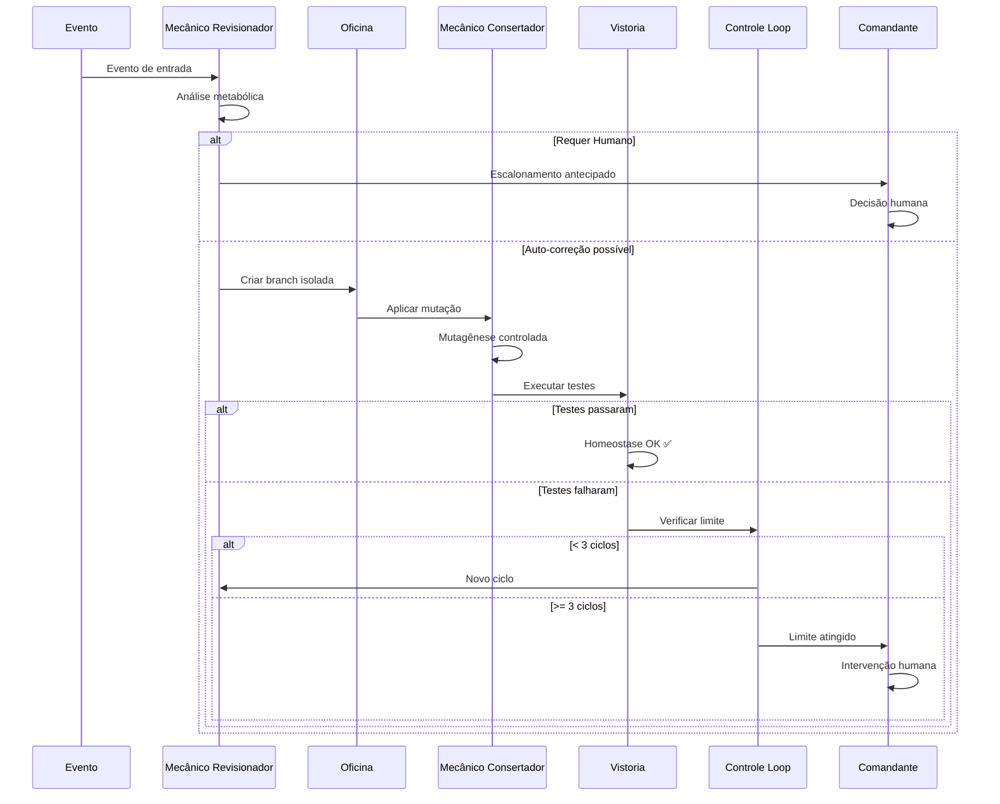

# Fluxo de Metabolismo do Jarvis

## 📋 Índice

- [Conceito Central](#conceito-central)
- [Arquitetura](#arquitetura)
- [Componentes](#componentes)
- [Fluxo Completo](#fluxo-completo)
- [Uso](#uso)
- [Princípios Fundamentais](#princípios-fundamentais)

---

## Conceito Central

O **Jarvis é tratado como um organismo de software**. Seu repositório representa seu **DNA**. Qualquer alteração nesse DNA deve passar por um **processo metabólico controlado, rastreável e validado**.

O Fluxo de Metabolismo do Jarvis **NÃO se limita à correção de erros**. Ele é acionado sempre que houver qualquer evento que impacte o DNA do Jarvis.

### Metáfora Biológica

| Conceito Biológico | Equivalente no Jarvis |
|-------------------|----------------------|
| **DNA** | Repositório (código-fonte) |
| **Mutação** | Mudança no código |
| **Metabolismo** | Processo de análise e aplicação de mudanças |
| **Sistema Imunológico** | Testes automatizados (pytest) |
| **Homeostase** | Estado funcional/estável do código |
| **Célula** | Módulo/componente do sistema |

---

## Arquitetura

```
┌─────────────────────────────────────────────────────────────┐
│                   FLUXO DE METABOLISMO                      │
├─────────────────────────────────────────────────────────────┤
│                                                             │
│  1. EVENTO DE ENTRADA                                       │
│     ↓                                                       │
│  2. MECÂNICO REVISIONADOR (Análise Metabólica)             │
│     ├─→ Auto-correção? → SIM → 4. OFICINA                 │
│     └─→ Requer humano? → SIM → 8. COMANDANTE              │
│                                                             │
│  4. OFICINA (Branch Isolada)                               │
│     ↓                                                       │
│  5. MECÂNICO CONSERTADOR (Mutagênese)                      │
│     ↓                                                       │
│  6. VISTORIA (Homeostase - Pytest)                         │
│     ├─→ Passou? → SIM → Sucesso                           │
│     └─→ Falhou? → 7. CONTROLE DE LOOP                     │
│                                                             │
│  7. CONTROLE DE LOOP                                        │
│     ├─→ < 3 ciclos? → Volta para 2                        │
│     └─→ = 3 ciclos? → 8. COMANDANTE                       │
│                                                             │
│  8. COMANDANTE (Consciência Superior - Humano)             │
│                                                             │
│  9. PRINCÍPIOS FUNDAMENTAIS                                 │
│     - DNA é sagrado                                        │
│     - Toda mutação deve ser compreendida                   │
│     - Testes são o sistema imunológico                     │
│     - Automatizar sem perder consciência                   │
│     - O humano sempre tem a palavra final                  │
│                                                             │
└─────────────────────────────────────────────────────────────┘
```

---

## Componentes

### 1. EVENTO DE ENTRADA — "O METABOLISMO COMEÇA"

O fluxo pode ser iniciado por **QUALQUER evento** que demande ação sobre o DNA:

- ✅ **Erros e falhas técnicas** (bugs, crashes)
- ✅ **Solicitações de edição ou refatoração**
- ✅ **Criação de novas funcionalidades**
- ✅ **Ações operacionais automatizadas**
- ✅ **Aprimoramentos de performance ou segurança**
- ✅ **Pull Requests** (humanos ou automáticos)
- ✅ **Issues, comentários ou comandos via API**
- ✅ **Alterações manuais feitas por desenvolvedores**

#### Tipos de Eventos Suportados

| Evento GitHub | Descrição | Exemplo |
|--------------|-----------|---------|
| `issues` | Issue criada/editada com label `auto-code` | Bug report automático do CI |
| `pull_request` | PR aberto/sincronizado | Validação de mudanças propostas |
| `repository_dispatch` | Chamada via API do Jarvis | `jarvis_order`, `auto_fix`, `metabolism_event` |
| `workflow_dispatch` | Trigger manual | Operação manual pelo desenvolvedor |

**REGRA FUNDAMENTAL:** Todo evento é tratado como uma **INTENÇÃO TÉCNICA** sobre o DNA do Jarvis, não apenas como erro.

---

### 2. MECÂNICO REVISIONADOR — Análise Metabólica

**Apelido:** Mecânico Revisionador  
**Identidade:** GitHub Copilot + Claude Code via GitHub CLI  
**Script:** `scripts/metabolism_analyzer.py`

#### Responsabilidades Obrigatórias

1. **Interpretar a intenção do evento:**
   - `correção` - Corrigir erros
   - `criação` - Criar novas funcionalidades
   - `modificação` - Modificar funcionalidades existentes
   - `otimização` - Otimizar performance/segurança
   - `operacional` - Ações operacionais automatizadas

2. **Coletar contexto completo:**
   - Logs de erro
   - Stacktrace (se houver)
   - Commits recentes
   - Diff relacionado
   - Histórico do código afetado
   - Testes impactados
   - Contratos existentes

3. **Classificar o tipo de impacto no DNA:**
   - `estrutural` - Mudanças na arquitetura
   - `comportamental` - Mudanças no comportamento
   - `regressivo` - Correções que podem afetar código existente
   - `expansivo` - Adição de novas capacidades

4. **Formular EXPLICITAMENTE:**
   - Motivação da mudança
   - Impacto esperado
   - Riscos associados
   - Hipótese técnica

5. **Propor UMA OU MAIS abordagens**

6. **Selecionar a abordagem MAIS SEGURA, MAIS COERENTE e MAIS ALINHADA ao estado atual do DNA**

**REGRA ABSOLUTA:** Nenhuma alteração no DNA é aplicada sem compreensão explícita da intenção e do impacto.

---

### 3. CRITÉRIO DE ESCALONAMENTO ANTECIPADO

O Mecânico Revisionador **DEVE interromper** o fluxo automático e chamar o **COMANDANTE IMEDIATAMENTE** se:

- ❌ A intenção depende de **decisão de negócio**
- ❌ Há **ambiguidade funcional** não resolvível por código
- ❌ Falta **contexto humano ou externo**
- ❌ O **impacto no DNA é amplo ou irreversível**
- ❌ A alteração exige **julgamento arquitetural humano**

**Neste caso:**
- ⛔ **NÃO executar metabolismo automático**
- 📢 **Escalar diretamente ao Comandante**

---

### 4. OFICINA — Execução Metabólica

**Apelido:** Oficina  
**Identidade:** GitHub Actions  

#### Funções

- 🌿 Criar **branch isolada** para metabolismo
- 🔒 Aplicar **SOMENTE as alterações aprovadas**
- 🛡️ Preservar **integridade do DNA**
- 📝 Registrar **todas as mutações em logs auditáveis**

**REGRA:** Nenhuma mutação silenciosa é permitida.

---

### 5. MECÂNICO CONSERTADOR — Mutagênese Controlada

**Apelido:** Mecânico Consertador  
**Identidade:** Workflow automatizado + GitHub Copilot  
**Script:** `scripts/metabolism_mutator.py`

#### Responsabilidades

- 🧬 Implementar a **mutação proposta**
- 🧪 Atualizar ou criar **testes (anticorpos)**
- 📐 Respeitar **padrões e contratos existentes**
- 🎯 Evitar **mutações desnecessárias**

#### Estratégias de Mutação

| Estratégia | Descrição | Safety Score |
|-----------|-----------|--------------|
| `minimal_change` | Menor mudança possível | 9/10 |
| `comprehensive_fix` | Correção abrangente de casos relacionados | 7/10 |
| `incremental_addition` | Adição em etapas incrementais | 8/10 |

---

### 6. VISTORIA — Homeostase

**Apelido:** Vistoria  
**Identidade:** Pytest (Sistema Imunológico)  

#### Processo

1. 🧪 Executar a **suíte de testes**
2. ✅ Validar que o **DNA permanece funcional**

#### Decisão Automática

```
SE testes PASSAREM:
  ✅ Homeostase mantida → Avançar no metabolismo
SENÃO:
  ❌ Homeostase comprometida → Retornar ao Mecânico Revisionador
```

---

### 7. CONTROLE DE LOOP — Limite Metabólico

O metabolismo automático é limitado a:

### **MÁXIMO DE 3 CICLOS COMPLETOS**

**Ciclo** = Análise → Mutação → Vistoria

#### Regras Críticas

- ⚠️ Ao atingir **3 falhas consecutivas**, o metabolismo automático **DEVE cessar**
- 🚫 O Mecânico Revisionador **NÃO pode tentar uma 4ª vez**
- 📢 O sistema **DEVE escalar ao COMANDANTE**

```
Ciclo 1: Análise → Mutação → Vistoria → FALHOU
Ciclo 2: Análise → Mutação → Vistoria → FALHOU
Ciclo 3: Análise → Mutação → Vistoria → FALHOU
         ↓
    LIMITE ATINGIDO → Escalar ao COMANDANTE
```

---

### 8. COMANDANTE — Consciência Superior

**Apelido:** Comandante  
**Identidade:** Humano mantenedor do Jarvis  

#### O Comandante Recebe

- 📋 **Evento original** (intenção)
- 📊 **Histórico metabólico completo**
- 🔍 **Análises e decisões tomadas**
- 🧬 **Mutações aplicadas** (diffs)
- 🧪 **Resultados da vistoria**
- ⚠️ **Riscos e limitações identificadas**

#### Ação Final

O Comandante pode:
- ✅ **Aprovar** a mutação
- ✏️ **Ajustar** a mutação
- ❌ **Rejeitar** a mutação

---

### 9. PRINCÍPIOS FUNDAMENTAIS DO JARVIS

Os princípios que regem todo o metabolismo:

1. 🧬 **O DNA é sagrado** - Toda mudança é rastreada e auditada
2. 🔍 **Toda mutação deve ser compreendida** - Sem alterações cegas
3. 🧪 **Testes são o sistema imunológico** - Proteção contra regressões
4. 🤖 **Automatizar sem perder consciência** - IA assistida, humano no controle
5. 👤 **O humano sempre tem a palavra final** - O Comandante decide

---

## Fluxo Completo

### Diagrama de Sequência



---

## Uso

### Ativar o Metabolismo via API

```bash
# Enviar evento via repository_dispatch
curl -X POST \
  -H "Accept: application/vnd.github+json" \
  -H "Authorization: Bearer YOUR_TOKEN" \
  https://api.github.com/repos/OWNER/REPO/dispatches \
  -d '{
    "event_type": "metabolism_event",
    "client_payload": {
      "intent": "correção",
      "instruction": "Corrigir erro de importação no módulo X",
      "context": "O módulo Y está falhando ao importar Z"
    }
  }'
```

### Ativar via Issue

1. Criar uma issue no GitHub
2. Adicionar label `metabolism` ou `auto-code`
3. O workflow será acionado automaticamente

### Ativar Manualmente (Workflow Dispatch)

1. Ir para Actions → Jarvis Metabolism Flow
2. Clicar em "Run workflow"
3. Preencher:
   - **Intent:** `correção`, `criação`, etc.
   - **Instruction:** Descrição detalhada
   - **Context:** (Opcional) Informações adicionais

---

## Logs e Auditoria

Todos os eventos metabólicos são registrados em:

- 📁 `.github/metabolism_logs/`
  - `analysis_YYYYMMDD_HHMMSS.json` - Análises metabólicas
  - `mutation_YYYYMMDD_HHMMSS.json` - Mutações aplicadas

- 📁 `.github/metabolism_markers/`
  - `mutation_YYYYMMDD_HHMMSS.md` - Marcadores de mutação manual

Estes arquivos são **versionados no Git** para rastreabilidade completa.

---

## Diferenças vs. Self-Healing Antigo

| Aspecto | Self-Healing (Antigo) | Metabolism Flow (Novo) |
|---------|----------------------|------------------------|
| **Conceito** | Correção de erros | Metabolismo de organismo |
| **Escopo** | Apenas bugs | Qualquer mudança no DNA |
| **Análise** | Automática simples | Mecânico Revisionador completo |
| **Escalonamento** | Após 3 falhas | Antecipado quando necessário |
| **Logs** | Básicos | Auditoria metabólica completa |
| **Terminologia** | Técnica | Metáfora biológica |
| **Consciência** | Limitada | Compreensão explícita obrigatória |

---

## Exemplos de Uso

### Exemplo 1: Correção de Bug

**Evento:** CI detecta teste falhando  
**Fluxo:**
1. Evento → Mecânico Revisionador
2. Análise: `correção`, `regressivo`, `minimal_change`
3. Oficina cria branch `metabolism/mutation-1234567890`
4. Mecânico Consertador aplica correção
5. Vistoria executa pytest → ✅ Passou
6. PR criado automaticamente

### Exemplo 2: Nova Funcionalidade

**Evento:** Issue solicitando nova feature  
**Fluxo:**
1. Evento → Mecânico Revisionador
2. Análise: `criação`, `expansivo`
3. **Escalonamento Antecipado** (decisão de negócio)
4. Comandante recebe relatório
5. Comandante decide se aprova/rejeita

### Exemplo 3: Refatoração Arquitetural

**Evento:** PR propondo mudança na arquitetura  
**Fluxo:**
1. Evento → Mecânico Revisionador
2. Análise: `modificação`, `estrutural`
3. **Escalonamento Antecipado** (julgamento arquitetural)
4. Comandante recebe análise de impacto
5. Comandante decide

---

## Monitoramento

### GitHub Actions

- Ver execuções: `Actions` → `Jarvis Metabolism Flow`
- Cada execução mostra:
  - 📋 Análise metabólica
  - 🧬 Mutações aplicadas
  - 🧪 Resultados dos testes
  - 📊 Decisões tomadas

### Issues

- Issues com label `commander-review` = Requerem intervenção
- Issues com label `metabolism` = Eventos metabólicos

---

## Próximos Passos

Para usar o Fluxo de Metabolismo:

1. ✅ Certifique-se que GitHub Copilot está disponível
2. ✅ Configure `JARVIS_TOKEN_CI` nos secrets
3. ✅ Adicione labels `metabolism` ou `auto-code` em issues relevantes
4. ✅ Monitore execuções em GitHub Actions
5. ✅ Revise issues marcadas como `commander-review`

---

## Contribuindo

Ao fazer mudanças no Fluxo de Metabolismo:

- 🧪 Sempre adicionar/atualizar testes
- 📝 Documentar mudanças neste arquivo
- 🔍 Seguir os Princípios Fundamentais
- 👥 Pedir revisão ao Comandante (maintainer)

---

**"O DNA é sagrado. Toda mutação deve ser compreendida."**

*— Princípios Fundamentais do Jarvis*
